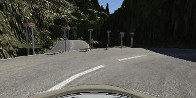
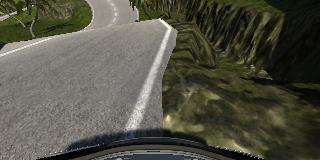
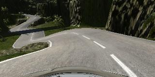
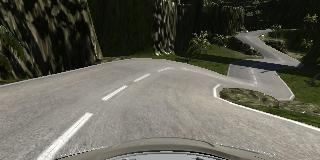
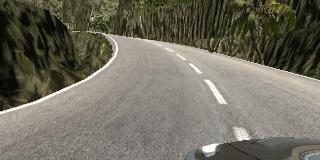
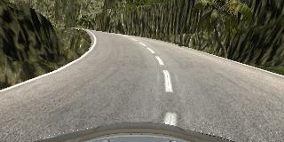
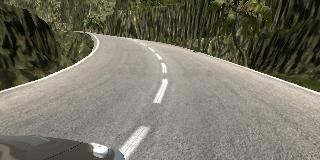

**Behavioral Cloning** 

In this project for udacity I developed a convolutional neural network in Keras to drive a car in a simulator. The network is based on [NVIDIA's approach](https://arxiv.org/pdf/1604.07316) of End-to-End Learning for Self Driving Cars. This is basically a deep learning only solution without any conventional feature extraction (such as image processing, filtering etc) - apart from normalizing the input data. My solution runs in the default udacity setup, which uses the center camera images of the simulated car to drive it safely on the road. I am particularly proud of the [successful solution](video_hilly.mp4) of the second, much more difficult track. 

For the detailed description of my solution please read the following sections.

---
The goals / steps of this project were the following:
* Use the simulator to collect data of good driving behavior
* Build, a convolution neural network in Keras that predicts steering angles from images
* Train and validate the model with a training and validation set
* Test that the model successfully drives around track one without leaving the road
* Summarize the results with a written report

## Rubric Points

### Files Submitted & Code Quality

#### 1. Submission includes all required files and can be used to run the simulator in autonomous mode

My project includes the following files:
* model.py containing the script to create and train the model
* drive.py for driving the car in autonomous mode
* model.h5 containing a trained convolution neural network 
* README.md summarizing the results

#### 2. Submission includes functional code
Using the Udacity provided simulator and my drive.py file, the car can be driven autonomously around the track by executing 
```sh
python drive.py model.h5
```

#### 3. Submission code is usable and readable

The model.py file contains the code for training and saving the convolution neural network. The file shows the pipeline I used for training and validating the model, and it contains comments to explain how the code works.

### Model Architecture and Training Strategy

#### 1. An appropriate model architecture has been employed

My model is based on the NVIDIA solution for self driving cars. This is a multilayer convolutional neural network built in Keras consisting of one cropping, one normalizing, 5 convolutional and 4 fully connected layers with a single output (which is the driving angle).

The cropping layer cuts off the top 55 and bottom 25 pixels which are usually don't contain valuable information but with this I was able to reduce the input size to the half (from 160x320x3 to 80x320x3). 

The model uses RELU as activation function to introduce nonlinearity, and the data is normalized in the model using a Keras lambda layer.

The detailed description of the model is the following:

|Layer	                | Description                                   |
|:---------------------:|:---------------------------------------------:|
|Input	|160x320x3 RGB image A|
|Cropping	|Crop top 55 pixels and bottom 25 pixels; output shape = 80x320x3|
|Normalization	|value/255 - 0.5|
|Convolution 5x5	|5x5 kernel, 2x2 stride, 24 output channels, output shape = 38x158x24|
|RELU	|	|
|Convolution 5x5	|5x5 kernel, 2x2 stride, 36 output channels, output shape = 17x77x36|
|RELU	|	|
|Convolution 5x5	|5x5 kernel, 2x2 stride, 48 output channels, output shape = 7x37x48|
|RELU	|	|
|Convolution 5x5	|3x3 kernel, 1x1 stride, 64 output channels, output shape = 5x35x64|
|RELU	|	|
|Convolution 5x5	|3x3 kernel, 1x1 stride, 64 output channels, output shape = 3x33x64|
|RELU	|	|
|Flatten|	Input 3x33x64, output 6336|
|Fully connected|	Input 6336, output 100|
|Fully connected|	Input 100, output 50|
|Fully connected|	Input 50, output 10|
|Fully connected|	Input 10, output 1 (labels)|

The network has 770619 total training parameters. 

#### 2. Attempts to reduce overfitting in the model

The original dataset contained 24155 images, which is not bad, but all of them are from the first track. I inatially trained my network on this dataset and tested an the first track only. It started to work reasonably quite early on using the NVIDIA network but the results on the other track was a complete disaster. I guessed it might just have learned the first track so I introduced many dropout layers (on the output and on the fully connected layers) but the results did not improve. So I choose an approach to create a bigger and more diverse dataset and created more than 40000 extra images for training. I also removed most of the straight images (those without angle correction). 

On my much bigger dataset I also experimented with dropout but the results did not improve (but deteriorate) and the network itself did not show signs of overfitting either (the loss on the training and validation set correlated reasonably). The reason for this could be that the input is very noisy and nondeterministic (especially on my data where I used keyboard input during training). As I created quite a lot of extra training data the noise itself could prevent overfitting.

The model was trained and validated on five different data sets to test and ensure that the model was not overfitting. The model was tested by running it through the simulator and ensuring that the vehicle could stay on the track. The results are good on tracks as the car drives without problems even with faster speeds (15 or even 30 mph)

#### 3. Model parameter tuning

I used an adam optimizer, so the learning rate was not tuned manually.

#### 4. Appropriate training data

Training data was chosen to keep the vehicle driving on the road. I used a combination of center lane driving, recovering from the left and right sides of the road, driving in the opposite direction and on both tracks. 

For details about how I created the training data, see the next section. 

### Model Architecture and Training Strategy

#### 1. Solution Design Approach

The overall strategy for deriving a model architecture was to create a relatively simple approach but my goal was to achieve at least a partial solution on the more difficult track as well.

My first step was to use a convolution neural network model similar to the LeNet. I thought this model might be appropriate because I used it successfully in the previous (traffic sign identification) project. However, as it did not give perfect results even on the difficult parts of the first track, I moved on to a more powerful network, which NVIDIA proposed as a self driving car solution.

In order to gauge how well the model was working, I split my image and steering angle data into a training and validation set. As I created a lot of extra images it was impossible to keep all of them in the memory. So I created a generator function which loads the images as they are needed. This keeps the required memory size on a manageable level. 

After the training I always run the simulator to see how well the car was driving around track one (and later on track two). The results became quite good relatively early on the first track but on the second I had to tune my network quite a lot. For example after only training on the initial dataset I got better results when using at least one dropout layer. After loading the full dataset I had to remove all dropout layers because it made the results noticeably worse.

At the end of the process, the vehicle is able to drive autonomously around both tracks without leaving the road.

#### 2. Final Model Architecture

After all those experimenting with dropouts my final model architecture became the original NVIDIA network (which I already presented)

#### 3. Creation of the Training Set & Training Process

I did not create any extra images on the first track because the results were good using only the provided dataset. I needed to create a lot of extra images on the second track, however. This includes driving on both directions (one-one circle) and partially recording some of the harder curves. There is one particularly hard part on the track where a difficult shadow cheats the network from turning and it usually drives straight to the wall instead.



Because the second track had some really hard turns which challenged even me to drive on the middle of the road (I did not always manage to keep the car on the road, even) I did not create any extra recovery because hard turns and almost-fall-offs were quite regular in the training set.



To augment the data set, I flipped all the images and angles. This created a whole lot of extra training data practically for free.

|Original	              | Flipped               |
|:---------------------:|:---------------------:|
|||

I also included all the left and right camera angles for training, using only a relatively small correction. My correction angle value is a result of a lot of experimentation and I am not sure that it would work for all other networks because I heard all kinds of tips for this value but for me the best value was 0.055 (and I tried almost everything between 0.05 and 0.125). With bigger corrections the car reacted more agressively at turns but this became a problem on the second track (where really hard turns are quite common) and the car either oversteered and fall off on the other side or was impossible to make the following hard turn.

|Left	                  | Centre                |Right                  | 
|:---------------------:|:---------------------:|:---------------------:|
||||

After the this, I randomly removed 3/4 of the non-steering images to keep a more healthy ratio between straight sections and curves. Eventually, I had more than 90000 data points. As preprocessing I used only normalization and cropping.

I finally randomly shuffled the data set and put 20% of the data into a validation set. In the validation set I only kept the center images because the network will see only these during driving. This showed a more realistic performance during training which helped me to tune how many epochs I needed to run my training. Eventually I choose 5 after which the validation loss plateaued. One epoch ran for about 2 minutes on my Geforce 980Ti.

As I used an adam optimizer manually training the learning rate wasn't necessary.
